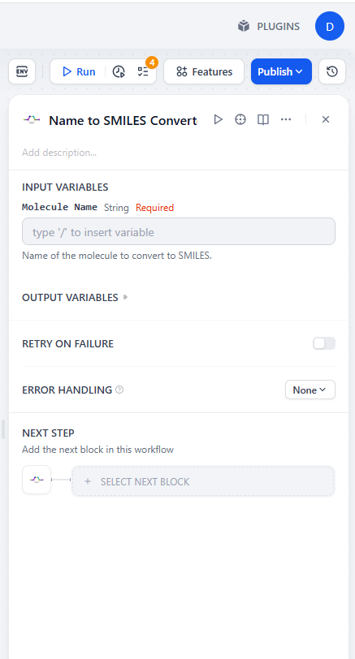
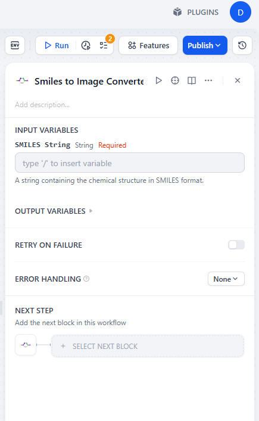
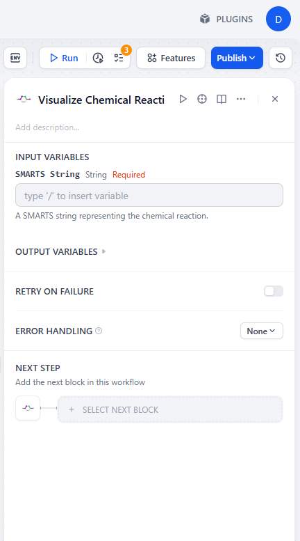
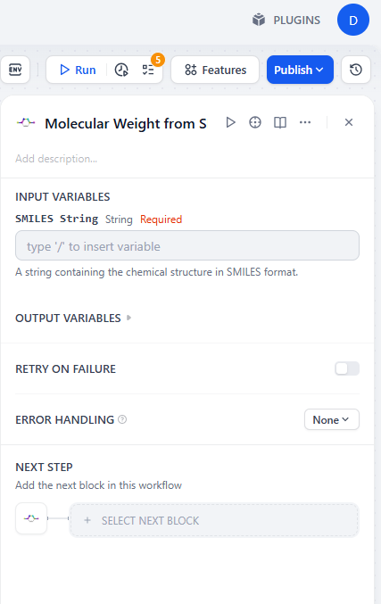
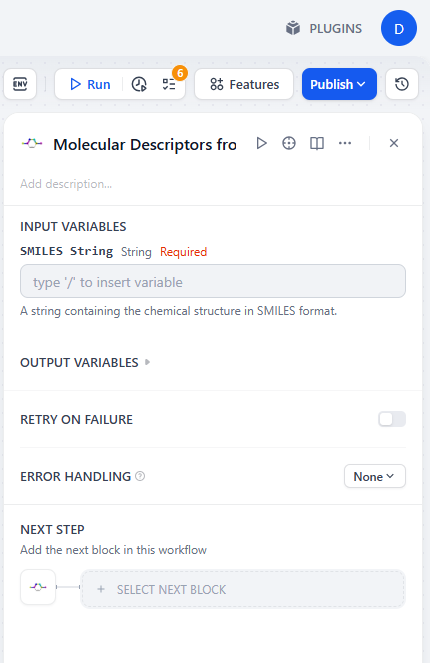

# rdkit Dify Plugin

**Author:** s20ss  
**Version:** 0.0.1  
**Type:** tool  

## Description

A Dify plugin that leverages the [RDKit](https://www.rdkit.org/) Python library to provide molecular information, generate images, and visualize chemical reactions. This plugin is designed for educational and utility purposes, enabling users to interact with chemical data and perform cheminformatics tasks within the Dify platform.

## Features

- Convert molecule names to SMILES strings
- Generate molecular images from SMILES
- Visualize chemical reactions
- Calculate molecular weight and descriptors

## Instructions

1. Download the package from the Dify Marketplace.
2. Add an **rdkit** node to your workflow or agent in Dify.
3. Run your flow to use the plugin's features.

## Configuration

No configuration is required. The plugin works out of the box after installation.

## Details about Tools
- Description about Plugin
    
- To convert molecule names to SMILES strings:  
    

- To generate molecular images from SMILES:  
    

- To visualize chemical reactions:  
    

- To calculate molecular weight from SMILES:  
    

- To calculate molecular descriptors from SMILES:  
    

